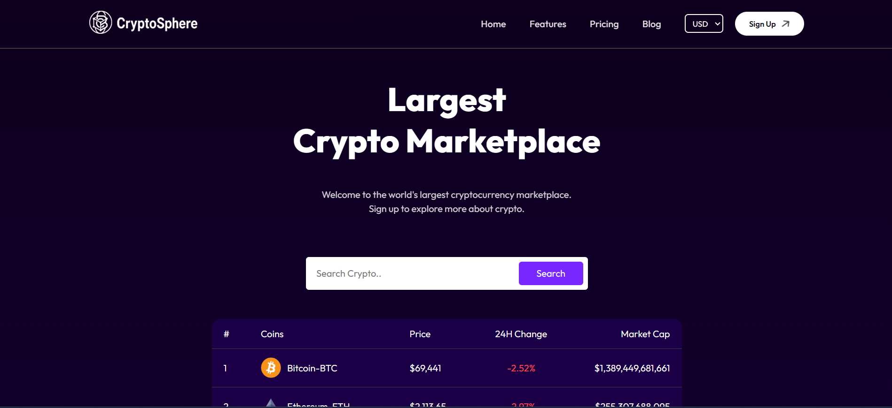
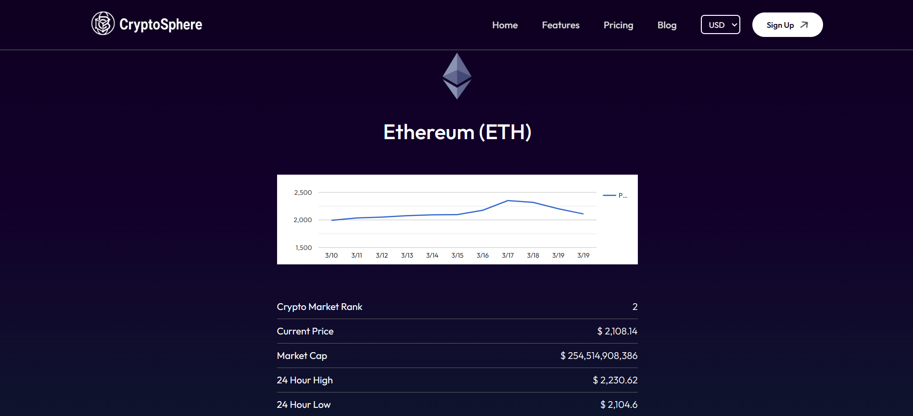
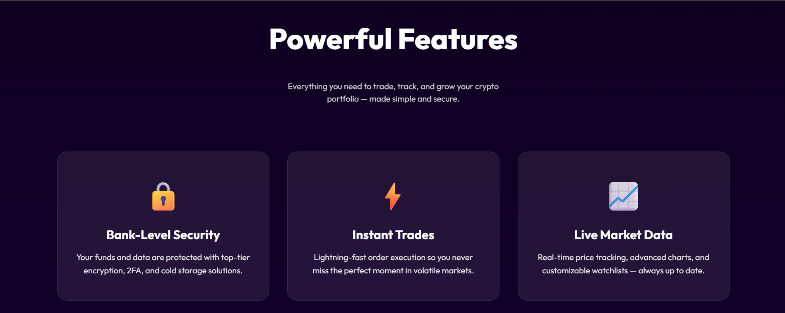
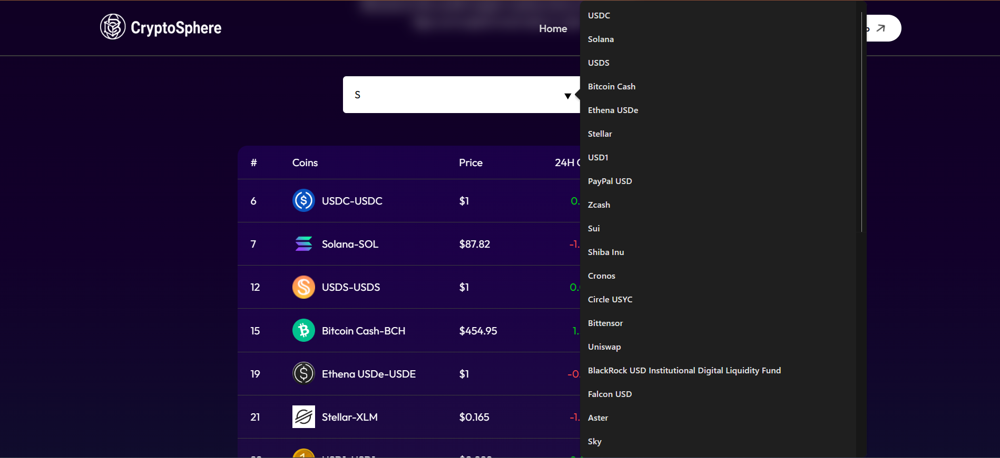

# 💹 CryptoSphere - Crypto Coins Dashboard

An interactive dashboard for tracking, analyzing, and visualizing cryptocurrency prices, trends, and market insights in real time.

---

## 📖 Table of Contents
- [Overview](#overview)
- [Features](#features)
- [Tech Stack](#tech-stack)
- [Installation](#installation)
- [Usage](#usage)
- [Project Structure](#project-structure)
- [Screenshots](#screenshots)
- [Contributing](#contributing)
- [License](#license)

---

## 📌 Overview
CryptoSphere provides a centralized platform to monitor live cryptocurrency data. With real-time updates, charts, and analytics, it helps users stay informed about market movements and make data-driven decisions.

---

## ✨ Features
- 📊 **Real-Time Price Tracking** – Live updates for major cryptocurrencies  
- 📈 **Interactive Charts** – Visualize trends and historical data  
- 🔍 **Search & Filter** – Quickly find coins by name or symbol  
- 🌐 **Global Market Data** – Market cap, volume, and dominance metrics  
- 📱 **Responsive Design** – Works seamlessly across devices  
- ⚡ **Fast Performance** – Optimized for speed and efficiency  

---

## 🛠 Tech Stack
- **Frontend:** React, Vite, JavaScript, React Router
- **Styling:** CSS, Google Fonts API
- **Data Source:** Cryptocurrency APIs (e.g., CoinGecko, CoinMarketCap), local pricing-data, News API (e.g., newsapi.org), Line Chart (e.g., Google Charts) 
- **State Management:** React Hooks, Context API  
- **Version Control:** Git & GitHub  

---

## 🚀 Installation

Clone the repository and install dependencies:

```bash
git clone https://github.com/your-username/cryptosphere-dashboardgit
cd cryptosphere-dashboard
npm install
npm run dev
npm run build
```

---

## 📂 Project Structure

```
my-dashboard/
├── node_modules/          # Installed dependencies
├── public/                # Static assets (favicon, index.html base)
├── src/
│   ├── assets/            # Images, icons, and other static resources
│   ├── Components/        # Reusable UI components (charts, tables, cards)
│   ├── Context/           # Global state management using Context API
│   ├── data/              # Static or mock data files
│   ├── Pages/             # Application pages (Dashboard, Coin Details, Analytics)
│   ├── App.jsx            # Root React component
│   ├── index.css          # Global styles
│   └── main.jsx           # Application entry point
├── .gitignore             # Git ignore rules
├── eslint.config.js       # ESLint configuration
├── index.html             # Main HTML template
├── package-lock.json      # Dependency lock file
├── package.json           # Project dependencies and scripts
├── README.md              # Project documentation
└── vite.config.js         # Vite configuration
```
---

## 🖼 Screenshots

<p align="center">
  
</p>

<p align="center">
  
</p>

<p align="center">
  
</p>

<p align="center">
  
</p>

<p align="center">
  
</p>

---

## 🤝 Contributing
-Contributions are welcome!

-Fork the repository

-Create a new branch (git checkout -b feature-name)

-Commit your changes (git commit -m "Add new feature")

-Push to your branch (git push origin feature-name)

-Open a Pull Request

---

## 📜 License
This project is licensed under the MIT License – feel free to use and modify it.

--

## 📧 Contact
Created by Yash Tagad – feel free to reach out for collaboration or feedback!
